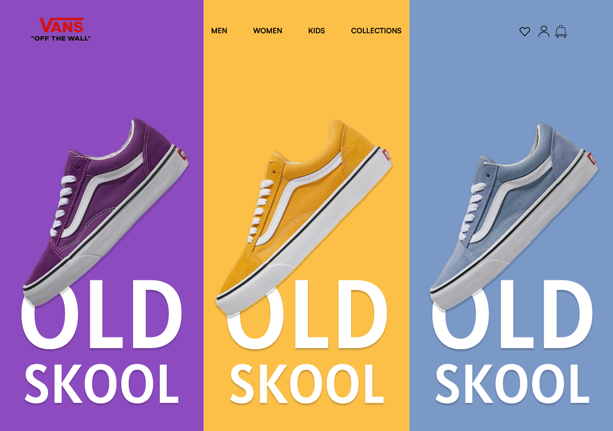
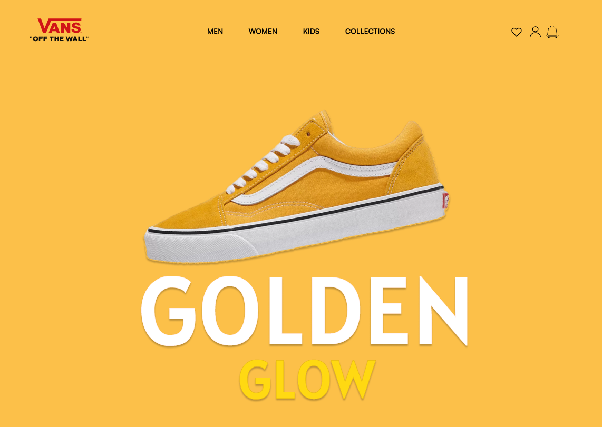
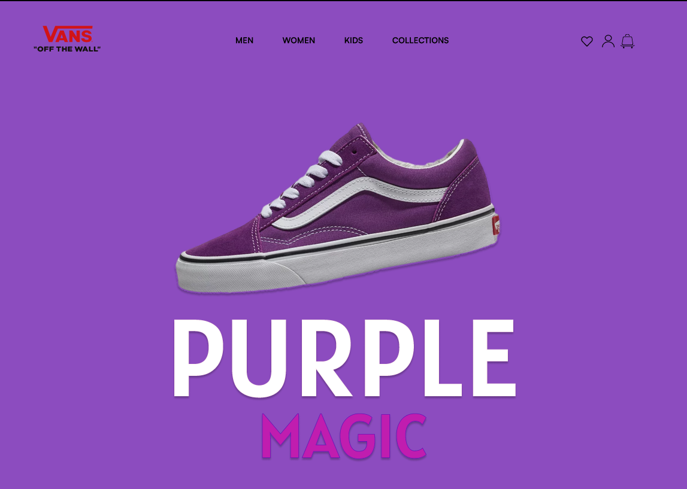
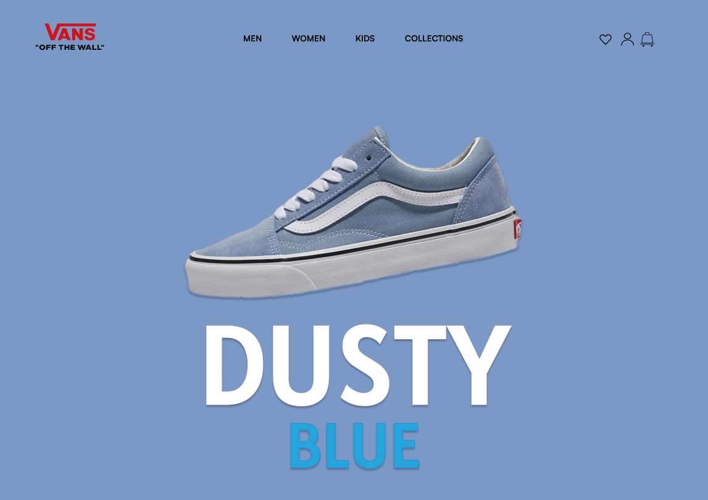

# Figma-Vans

# What is Figma?
Figma is a powerful tool that lets us design and prototype web apps before we develop them.

## Project Vans
A design prototype inspired by Vans products, I made a dynamic website 

## The Goal 🎯

[Run this website in Figma](https://www.figma.com/proto/0ymORQh4x7zpigj7g996jJ/Projeto-vans?node-id=25-632&t=Ge1nMfAEgWa2UBeC-0&scaling=contain&page-id=0%3A1&starting-point-node-id=19%3A421&content-scaling=fixed)

## How the project was done
The project was made using SVG and images, animations contained in figma itself, and some plugins that I will be making available

### Useful Figma plugins

[Unsplash](https://www.figma.com/community/plugin/738454987945972471/unsplash?searchSessionId=lukbta3a-st22o6azdvc)  
[Content Reel](https://www.figma.com/community/plugin/731627216655469013/content-reel?searchSessionId=lukbxhfn-ppprrax1gsn)
